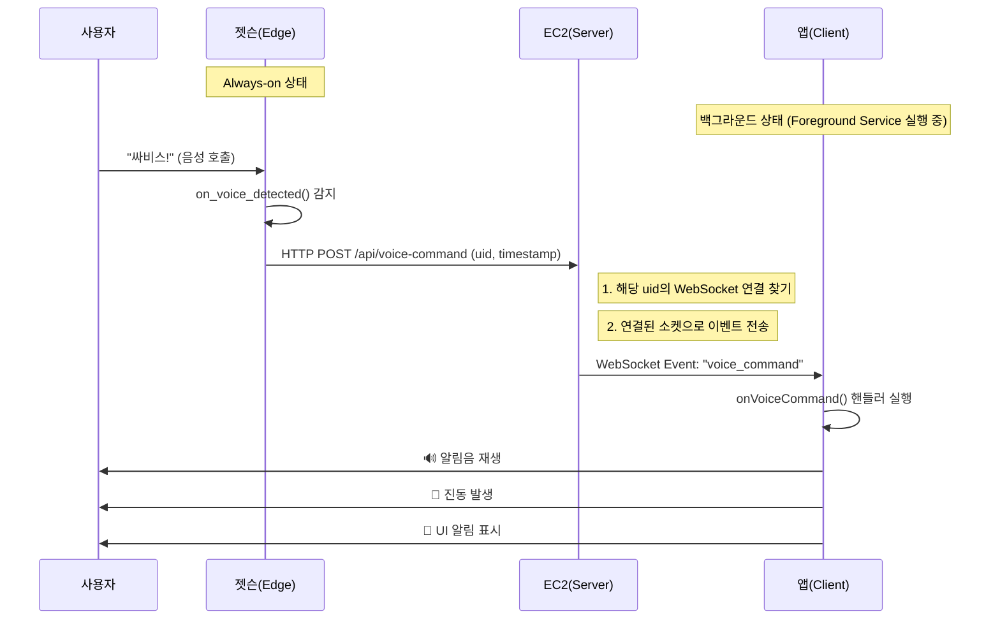

# SARVIS WebSocket & Foreground Service 아키텍처 가이드

이 문서는 SARVIS 프로젝트에 새롭게 도입되는 **실시간 음성 호출(Wake-up) 시스템**의 아키텍처와 로직을 설명합니다.

## 1. 도입 배경

사용자가 앱을 켜두지 않은 상태(백그라운드)에서도 젯슨(CCTV)이 "싸비스"라는 호출어를 감지하면, 즉시 앱이 반응(알림, 진동, 소리)해야 합니다. 이를 위해 서버가 앱을 실시간으로 깨울 수 있는 **WebSocket** 연결과, 안드로이드에서 연결을 유지하기 위한 **Foreground Service**를 도입했습니다.

## 2. 전체 데이터 흐름 (Workflow)

## 3. 핵심 기술 요소

### A. WebSocket (Socket.io)

- **역할**: 서버와 앱 간의 양방향 실시간 통신 채널.
- **주요 이벤트**:
  - `connect`: 연결 성공 (로그인 시 토큰 인증).
  - `disconnect`: 연결 종료.
  - `voice_command`: 젯슨이 호출을 감지했을 때 서버가 보내는 이벤트.

### B. Android Foreground Service

- **역할**: 안드로이드 OS가 배터리 최적화를 위해 백그라운드 앱의 네트워크 연결을 끊는 것을 방지.
- **형태**: 상단 알림바에 "SARVIS 서비스 실행 중" 같은 고정 알림(Notification)을 띄움으로써, OS에게 "이 앱은 중요한 작업을 수행 중이니 죽이지 마"라고 알리는 역할.

## 4. 앱 구현 구조 (Client Architecture)

### 4.1. Socket Provider (`providers/socket-provider.tsx`)

앱 전체에서 소켓을 관리하는 Context Provider입니다.

- **로그인 시**: `auth_token`을 헤더에 담아 소켓 연결 시도.
- **연결 성공 시**: Foreground Service 시작 (안드로이드).
- **이벤트 수신**: `voice_command` 수신 시 `handleVoiceCommand()` 실행.

### 4.2. 이벤트 핸들러 로직

`voice_command` 이벤트가 들어오면 다음 동작을 순차 수행합니다:

1. **Vibration**: `Vibration.vibrate(PATTERN)` 실행.
2. **Sound**: `expo-av`를 사용하여 알림 효과음 재생.
3. **UI**: 화면이 꺼져있거나 잠금 상태라면(가능한 경우) 깨우거나, 푸시 알림 표시.

## 5. 팀원 참고 사항

- **테스트 방법**: 개발 서버가 켜져 있어야 소켓 연결이 됩니다. (로그 확인: `[Socket] Connected`)
- **디버깅**: 앱 실행 시 상태바에 "SARVIS가 연결되어 있습니다" 알림이 떠 있다면 정상적으로 백그라운드 대기 중인 상태입니다.
