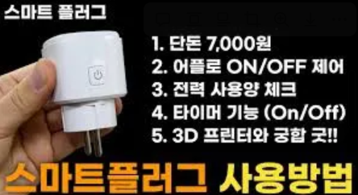

# 20260112 기획 및 고도화

## 스마트 전력량계
- 라인(회로) 단위 전력 측정
"어디서 많이 쓰는지"를 정확하게 알 수 있음

### 방법1
분전반에서 조명 회로, 콘센트 회로, 에어컨 회로 => 회로별로 전류 센서 부착

- 실제 가정에서는 분전반을 통해 회로별로 전력이 분리되므로, 회로 단위 측정은 전력 낭비 구간을 가장 직관적으로 파악할 수 있다.

- 미니 분전반 데모로 회로별 구조 모사

### 방법2
스마트 플러그로 기기별 측정 

- 분전반 접근이 어려운 환경을 고려해, 사용자가 직접 설치 가능한 스마트 플러그 기반 측정 방식을 대안으로 제시한다.

---
### 출력 결과 예시
- 회로/기기별 전력 소비 비율(%)
- 시간대별 전력 사용 그래프
- 상시 소비 전력(대기전력) 구간 표시

조명 회로: 22%, 
콘센트 회로: 45%, 
에어컨 회로: 33%

---
### 고도화 방향
- 전력 소비 원인 분석
- 사용자 인지 기반 절전 유도

---
## 지하철 환경센서 기반 미주신경성 실신 IoT
-> 개인이 진단하지 않고 실신이 잘 생기는 '상황'을 예측하고 즉시 개입
1. 센서 구성
혼잡도 : Co2,문 상단 ToF/IR 승하차 카운터, 차량 하중
열스트레스 : 온도, 습도
보조 : 저해상도 열화상(비식별)

2. 분석 방식
정차, 지연, 피크시간 등 운영 데이터를 결합

3. 대응
비식별 열화상으로 쓰러짐 조기 감지
위험도 히트맵 구축
자동 제어로 사전 예방 효과 추치화

---
+ 서기 역할