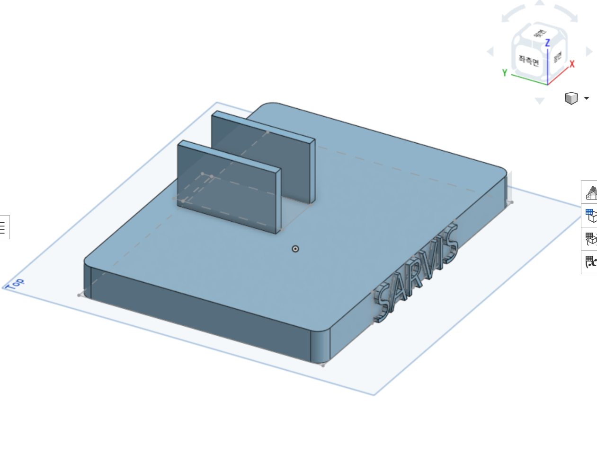

# Onshape 학습 및 로봇팔🦾 분석, 설계

1. Onshape **Assembly 모드 구조 이해**
2. STEP(STP) 파일을 불러왔을 때의 **구조 파악**
3. 기존 로봇팔 형상 **분해·분석**
4. 실제 사용될 **모터 크기 측정 및 적용 가능성 검토**
5. 기존 부품을 직접 수정하지 않고, **새 부품을 만드는 올바른 방법 이해**

---

## 오늘의 시행착오 & 배운 점

### ❌ 헤맸던 부분
stp 파일에서 많은 탭들을 불러오게 되어 조금의 혼잡이 있었으나,
폴더를 생성하여 해결하였다.
또한, 불러온 stp파일에서 수정이 되지 않아 많이 헤맸다.

### 🅾️ 배운 점
stp파일 수정하기 보단 새로 그리는 것이 낫다고 판단하여, 3D로 직접 그렸다.

## 1️⃣ Onshape 기본 구조 이해

### 📄 Document / Tab 개념 정리

* **Document**: 하나의 프로젝트 단위 (파일 개념)
* **Tab**:
  * Part Studio: 부품 제작
  * Assembly: 부품 조립
  * Drawing: 도면 생성

### 📁 폴더의 차이

* **홈 화면 폴더**: 문서(Document) 정리용
* **탭 폴더**: 하나의 문서 안에서 Part Studio / Assembly 정리용

→ STEP 파일을 불러오면 수많은 Part Studio 탭이 자동 생성되며, 이는 **탭 폴더로 정리해야 작업이 가능**하다는 것을 이해함.

---

## 2️⃣ Assembly 모드 이해

### 🔩 Assembly의 역할

* Part Studio에서 만든 부품을 조립만 하는 공간
---

## 3️⃣ STEP(STP) 파일 구조 분석

### ⚠️ 문제 상황

* STEP에서 생성된 스케치에 치수 수정 시도
* "스케치를 재생성할 수 없습니다" 오류 발생

### 💡 원인 정리

* STEP에서 가져온 형상은 **참조용 고체**
* 빨간 치수/점 = 수정 불가
* 기존 형상을 직접 고치는 방식은 구조적으로 불가능

---

## 4️⃣ STP 기반 수정의 정석 방법 이해

### ✅ 올바른 작업 흐름

1. **새 Part Studio 생성**
2. 기존 STEP 형상을 **Derived**로 가져오기 (참고용)
3. 새 스케치 생성 후 **Use(U)** 로 형상 참조
4. 필요한 치수(예: 2cm = 20mm)를 직접 정의
5. Extrude / Cut으로 **새 부품 설계**

👉 기존 형상은 건드리지 않고, **새 부품을 정확히 맞춰 설계**하는 방식

---

## 5️⃣ 로봇팔 구조 분석

### 🤖 분석 내용

* 기존 로봇팔 전체 구조 파악
* 관절 위치 및 연결 방식 확인
* 모터가 들어가는 공간 확인

### 📏 모터 관련 작업

* 실제 사용할 **모터 크기 측정**
* 기존 설계와 간섭 여부 검토
* 장착을 위해 필요한 **부품 수정 범위 파악**

---
