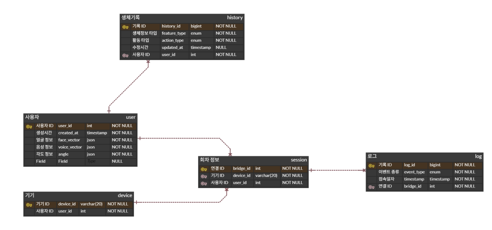

# 20260116
# 오늘 한 일
- ERD 다이어그램 1차 수정


- 카메라 작동 확인
```
import cv2

# CSI 카메라의 경우 GStreamer 파이프라인 설정이 필요할 수 있습니다.
cap = cv2.VideoCapture(0) 

while True:
    ret, frame = cap.read()
    if not ret:
        break
    
    cv2.imshow('S.A.R.V.I.S Camera Test', frame)
    if cv2.waitKey(1) & 0xFF == ord('q'):
        break

cap.release()
cv2.destroyAllWindows()
```

- 가상환경 세팅


# 다음 주 할 일
- 지라 정리
- AI 얼굴 인식 모델 학습
- 모델 경량화