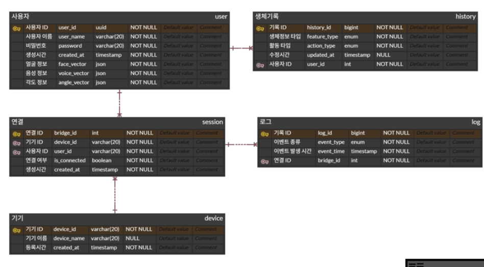

# 2026.01.16. 오늘 한 일
## ERD 설계 

로그 테이블
- 이벤트 종류 : login / logout / connect …

생체 기록 테이블
- 생체 정보 타입 : face / voice / angle
- 활동 타입 : create / update / reset ...

## 반드시 DB에 있어야 하는 것 
### 사용자 (user)

"이 사람이 누구인가"
저장
- 사용자 ID
- 생성 시간
- 얼굴 벡터
- 음성 벡터
- (기준 각도)

저장 X
- 현재 얼굴 각도
- 지금 거리
- 실시간 추적 상태

---

### 기기 (device)
"이 기기가 무엇인가"

저장
- 기기 ID
- 기기 이름

저장 X
- 지금 켜짐/꺼짐 상태
- 실시간 위치

---

## DB에 저장해야 하는 "관계와 시간"

### 연결 세션 (session)
"언제, 어떤 사용자와, 어떤 기기가 연결됐나"

저장
- 연결 ID
- 사용자 ID
- 기기 ID
- 연결 시작 시간
- 연결 종료 시간

저장 X
- 세션 중 실시간 상태

---

## DB에 저장해야 하는 "이력"

### 생체기록 (history)

"생체 정보가 언제, 왜 바뀌었나"

저장
- 생체정보 타입 (얼굴/음성)
- 활동 타입 (등록/수정/인증)
- 시간
- 사용자 ID
- (연결 ID)

---

### 로그 (log)

"그 세션 동안 무슨 일이 있었나"

저장
- 이벤트 종류
- 발생 시간
- 연결 ID

저장 X
- UI 클릭 하나하나
- 슬라이더 이동 중간값

