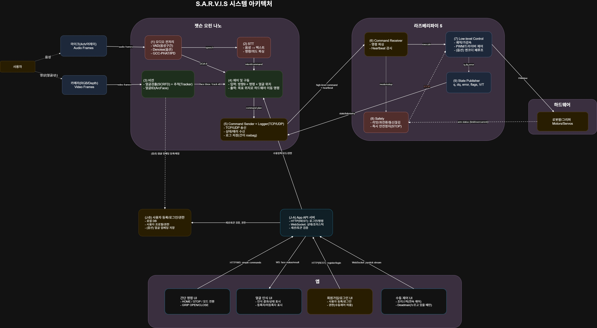

# 오늘 한 일

### 1. 기획 확정 및 기술 스택 정리
🔹시스템 역할 분담
- Jetson Orin Nano
    - 음성 인식(STT)
    - 오디오 전처리 및 방향 추정(VAD, DOA)
    - 얼굴 인식 및 추적(Vision)
    - 사용자 명령/센서 정보를 종합한 상위 제어(Planner)
    - 앱(App)과의 통신 서버(API)
- Raspberry Pi 5
    - 로봇팔 저수준 제어(Low-level Control)
    - 실시간 제어 루프 실행
    - 통신 상태 감시(Heartbeat)
    - 안전 제어 및 즉시 정지(Safety, STOP)
    - 로봇 상태(State) Jetson으로 피드백

🔹주요 하드웨어 구성
- Mic Array (4채널)
    - VAD(음성 구간 검출)
    - DOA(Direction of Arrival) 기반 사용자 방향 추정
- Camera (RGB / Depth)
    - 얼굴 검출(SCRFD)
    - 얼굴 추적(Tracker)
    - 얼굴 ID 인식(ArcFace, 선택)
    - 로봇팔 미세 위치 보정
- Robot Arm
    - 3D 프린터 기반 자체 제작 예정
    - 모터/서보 기반 구동
    - 리밋, 과전류 등 안전 요소 고려

### 2. 시스템 아키텍쳐 제작

🔹 전체 파이프라인 시각화
- 사용자 → 음성/영상 입력
- Jetson:

    (1) 오디오 전처리(VAD, DOA)

    (2) STT 및 명령 파싱

    (3) 비전(얼굴 검출/추적/인식)

    (4) 제어 및 구동(Planner)

    (5) Command Sender + Logger

- Raspberry Pi:

    (6) Command Receiver

    (7) Low-level Control

    (8) Safety (리밋/통신 끊김/STOP)

    (9) State Publisher

- App:

    얼굴 인식 UI

    수동 제어 UI(조이스틱 + Deadman)

    간단 명령 UI

    회원가입/로그인 UI